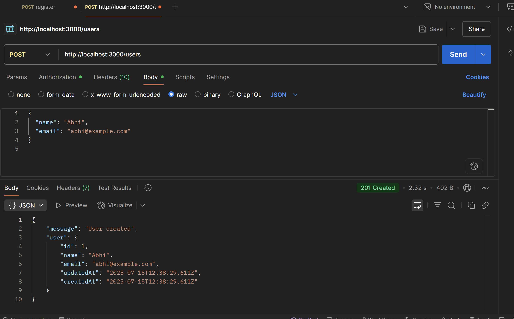
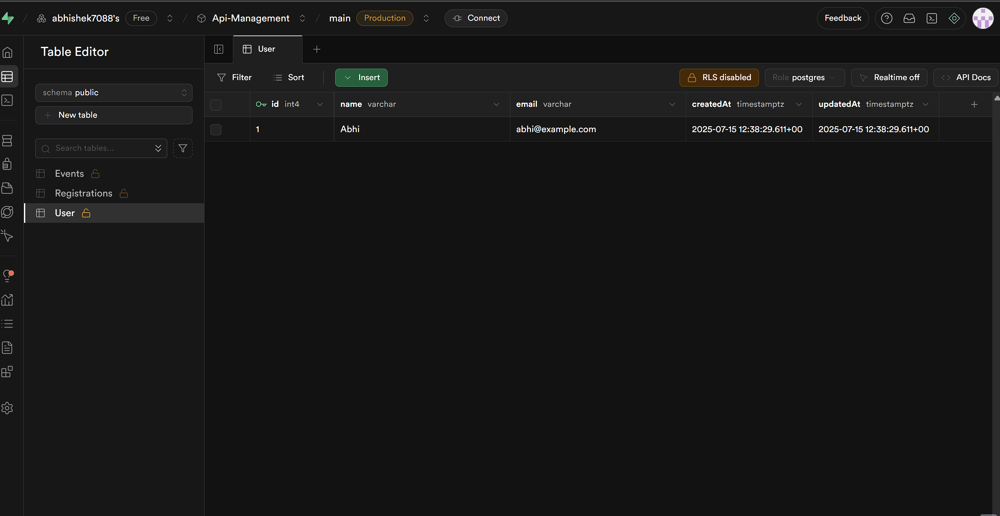
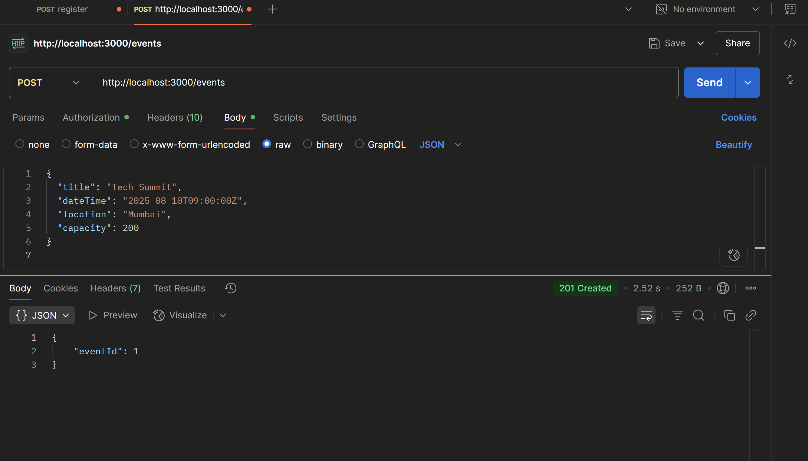
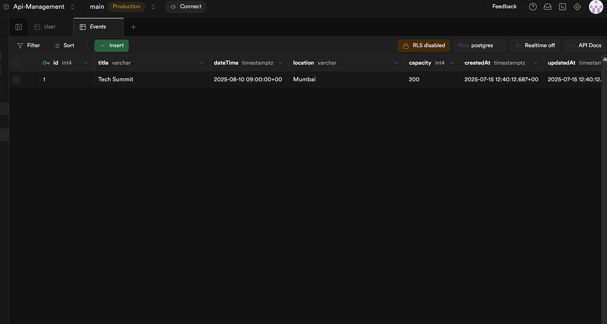
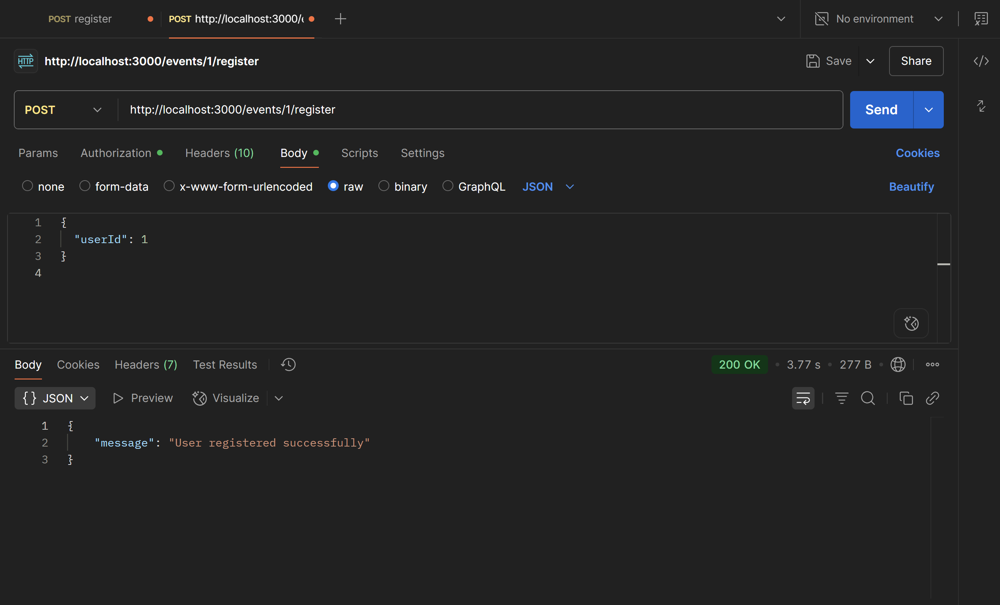
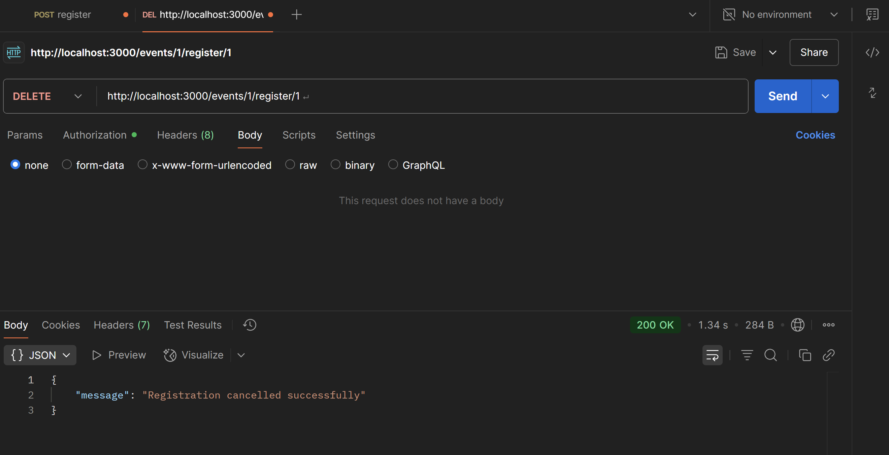
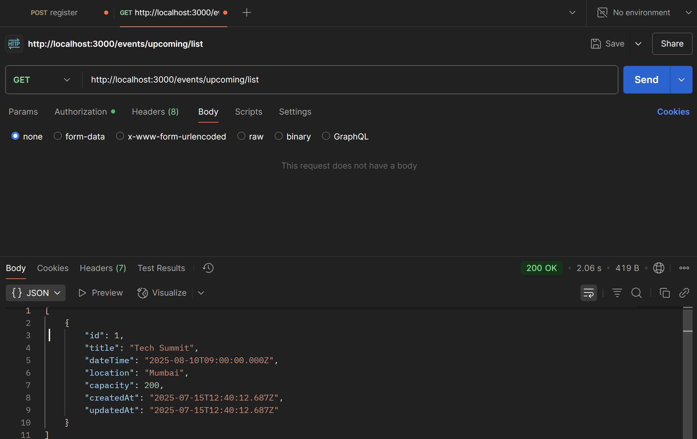
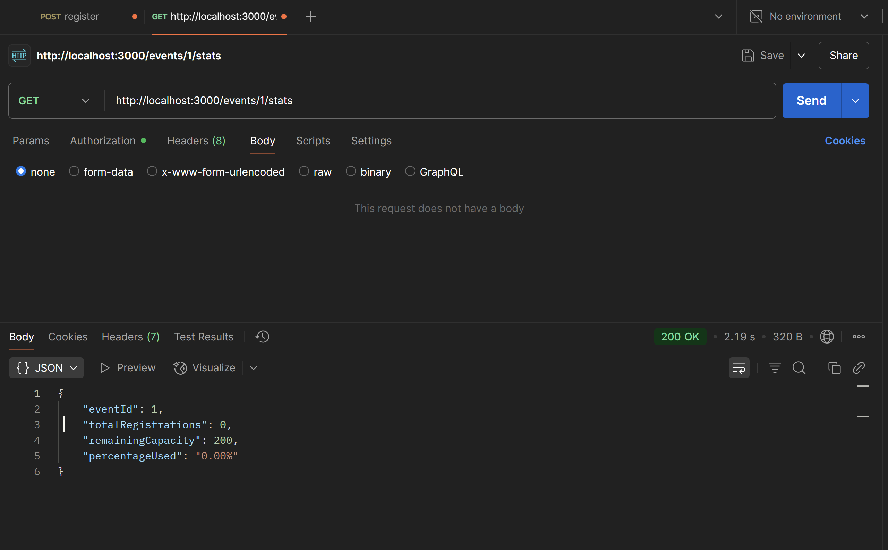

# 🎉 Event Management API

A RESTful API built with **Node.js**, **Express**, and **PostgreSQL (Supabase)** for managing events, user registrations, and real-time event stats.

---

## 🚀 Features

- Create and manage events (with title, date, location, capacity)
- Register and cancel event participation
- Enforce business rules: no duplicates, max capacity, no past events
- View upcoming events with custom sorting
- View event stats (total, remaining, percentage filled)

---

## 📦 Tech Stack

- **Node.js + Express** – REST API
- **PostgreSQL (Supabase)** – Cloud-hosted relational database
- **Sequelize** – ORM for model relationships
- **Dotenv** – Manage environment variables

---
## 📁 Project Structure
.
├── app.js
├── .env
├── config/
│ └── db.js
├── controllers/
│ ├── eventController.js
│ └── userController.js
├── models/
│ ├── Events.js
│ ├── Users.js
│ ├── Registration.js
│ └── index.js
├── routes/
│ ├── eventRoutes.js
│ └── userRoutes.js
└── README.md

## ⚙️ Setup Instructions
npm install


## 📸 Screenshots

### 1. User Registration


### 2. User Table


### 3. Event Creation


### 5. Event Table


### 4. Registration


### 6. Registration Table


### 7. Registration Deletion


### 8. Upcoming List


### 9. Stats



### 1. Clone the repository

```bash
git clone https://github.com/yourusername/event-management-api.git
cd event-management-api
